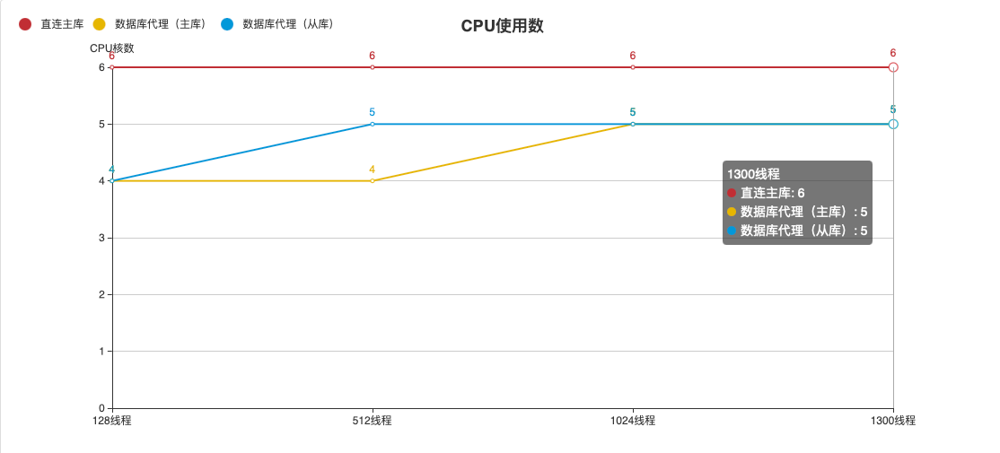

# 性能对比

使用数据库代理，一个重要的目的就是将数据库的请求压力分摊到从库上，从而保持数据库稳定运行。
当然，利用数据库代理的读写分离能力，可以大幅度提高整个数据库集群的请求处理能力，从而能更快的响应业务功能。

## 测试参数
本次压力测试采用业界标准的多线程性能测试工具sysbench测试程序。
- sysbench版本： sysbench 1.0.20
- sysbench测试机器：相同区域快杰o型云主机 CPU：8核  内存：8G
- 操作系统： Centos 8.3
- 测试数据集: 10张表，每张表数据1000w
- 代理节点服务配置8核16G

测试命令
```
sysbench --test=/usr/share/sysbench/oltp_read_only.lua --db-driver=mysql --mysql-host=$ip --mysql-port=3306 --mysql-user=xxxx --mysql-password=xxxxx --mysql-db=sysbenchtest --report-interval=5 --max-requests=0 --max-time=300 --num-threads=$thread_num run
```


## 读请求随压力变化曲线

如上图所示，我们采用2个代理节点针对一主双从的6C8G UDB MySQL实例进行不同压力连接数据库代理进行性能测试。
可以看到当数据库请求压力增大时，使用数据库代理展现出很好的稳定性。而直连主库会因为压力的增加展示除性能下降的一面。
同时，我们观察了不同情况下主从库的CPU压力情况，得到了如下曲线：

从图中可以看出，请求压力会被分摊到从库中，从而减少主库压力以提升性能。

